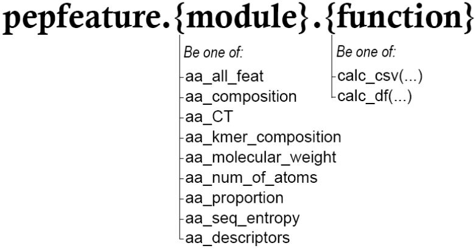

# Pepfeature
### _A package that consists of functions for calculating epitope/peptide features for prediction purposes_


### What is it

**Pepfeature** is a Python package providing routines for calculating peptide features on a given amino acid sequence.
These features can be used for macine learning purposes such as classification for epitiope prediction.

## Pepfeature Requirements
**Required Software/Tools:**  
- Tested on Python 3.8 (other Python 3 versions probably work too)

**Required Package Dependencies:**  
(Pepfeature has been tested on these versions of the dependancies. More recent versions of these dependancies may also be compatible with the Package.)
- et-xmlfile v1.1.0
- setuptools v56.0.0
- numpy v1.20.2
- openpyxl v3.0.7
- pandas v1.2.4
- python-dateutil v2.8.1
- pytz v2021.1
- six v1.15.0


## Installation

```
pip install Pepfeature
```
(All dependancies are expected to be automatically installed asswell with this 'pip install pepfeature' command.)
The source code is currently hosted on GitHub at: https://github.com/essakh/pepfeature

## Example Use
**NOTE: The Github contains an 'examples.py' in the root folder with many example use cases**

**Ensure at all times that any lines of code that utilize this package are executed within the code block:**
```python
if __name__ == '__main__':
```
Example:
```python
import pepfeature as pep
import pandas

df = pd.read_csv('pepfeature/data/Sample_Data.csv')

#Use of pepfeature
if __name__ == '__main__':
    #Calculate all features on df
    df_feat = pep.aa_all_feat.calc_df(dataframe=df, aa_column='Info_window_seq', Ncores=4, k=2)
 
    print(df_feat) #print the data frame to console
```

## Understanding the API

The API interface consists of calling two functions from 9 possibile modules, an overview of the modules and their two callable functions are illustrated in the figure below:


Thus, if in your python script you:
```python
import pepfeature
```
Then you will have the following possible API interfacing options, as illustrated in the image below:


Please see pepfeature/examples.py on the Github repo for example use cases.

Also see the attached API of each function/ algorithm, for a complete documentation.

## Functions documentation
### aa_all_feat
#### pepfeature.aa_all_feat.calc_csv
 Calculates all 8 features that this package calculates at once chunk by chunk from the inputted 'dataframe'. It saves each processed chunk as a CSV(s).
 
  This is a Ram efficient way of calculating the Features as the features are calculated on a single chunk of the dataframe (of chunksize number of rows) at a time and when a chunk has been been processed and saved as a CSV, then the chunk is deleted freeing up RAM.
 
 Results appended as a new column to input dataframe.
```python
pepfeature.aa_all_feat.calc_csv(dataframe, k, save_folder, aa_column = 'Info_window_seq', Ncores = 1, chunksize = None)
```
 **Parameters:**
- **`dataframe`** : `Pandas DataFrame object`
    - A pandas DataFrame that contains a column/feature that is composed of purely Amino-Acid sequences (pepides).
- **`k`** : `int`
    - Length of subsequences (this is used to calculate k-mer composition features)
- **`save_folder`** : `str`
    - Path to folder for saving the output as CSV
- **`aa_column`** : `str`,  `Default='Info_window_seq'`
    - Name of column in dataframe input consisting of the Amino-Acid sequences to process.
- **`Ncores`** : `int`,  `Default=1`
    - Number of cores to use for executing function (multiprocessing).
- **`chunksize`** : `int`,  `Default=None`
    - Number of rows to be processed at a time. (Where a 'None' object denotes no chunks but the entire dataframe to be processed)


 

 


## Contributing to pepfeature

All contributions, bug reports, bug fixes, documentation improvements, enhancements and ideas are welcome.
